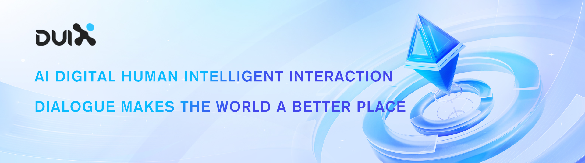

# Duix - Silicon-Based Digital Human SDK 🌐🤖   

<div style="width: 100%; text-align: center;">
  
</div>


## Introduction

DUIX, short for “Dialogue User Interface System”, is a digital human intelligent interaction platform created by Silicon Intelligence. The digital human SDK has been open-sourced, allowing developers to deploy on Android and iOS devices with one click, providing users with immediate virtual human interaction experience. The built-in two avatars allow users to easily get started and directly experience the charm of digital humans.

The SDK not only provides intuitive effect demonstration but also supports users for secondary development. Developers can easily develop customized virtual human applications based on the provided open documentation. The Silicon-based Digital Human SDK is completely open-source, with both the underlying inference engine and the upper-level commercial application logic open to source code. Developers can delve into its working principle and further optimize and innovate.<br><br>

## Applicable Scenarios

- Low deployment cost: No need for customers to provide technical teams for cooperation, supports low-cost rapid deployment on various terminals and large screens.
- Low network dependence: Suitable for virtual assistant self-service in scenarios such as subways, banks, and government affairs.
- Diverse functions: Can meet the diverse needs of video, media, customer service, finance, radio, and television in multiple industries according to customer requirements.<br><br>

## Core Functions

- Provides customized AI anchors and intelligent customer service for multi-scene image rental.
- Exclusive image customization: Supports the customization of exclusive virtual assistant images, with options for low-cost or deep image generation.
- Broadcast content customization: Supports the customization of exclusive broadcast content, applied in training, broadcasting, and other scenarios.
- Real-time interactive Q&A: Supports real-time dialogue, can also customize exclusive Q&A databases to meet consulting inquiries, voice chat, virtual companionship, and vertical scene customer service Q&A.<br><br>

## Source Code Directory Description

```
duix-android: android demo       
duix-ios: ios demo 
```
<br>

## Open Documentation Entry

For android, refer to [README_en.md](./duix-android/dh_aigc_android/README_en.md)

For ios, refer to [GJLocalDigitalSDK_en.md](./duix-ios/GJLocalDigitalDemo/GJLocalDigitalSDK_en.md)<br><br>

## Download Digital Human Local Model
We offer a selection of digital human models for download and use. We will update the local model packages from time to time so that you can download and utilize the latest models. Below is the list of currently available local model packages:
#### male
|   | | |
|:-------:|:-------:|:-------:|
| **Eric**<br>[Download](https://digital-public.obs.cn-east-3.myhuaweicloud.com/duix/digital/model/1716888516200/airuike_20240528.zip) | **Zi Xuan**<br>[Download](https://digital-public.obs.cn-east-3.myhuaweicloud.com/duix/digital/model/1716890628522/zixuan_20240529.zip) | **Ming Xuan**<br>[Download](https://digital-public.obs.cn-east-3.myhuaweicloud.com/duix/digital/model/1716034688/bendi3_20240518.zip) |

#### female
|  |  |  |  |  |
|:-------:|:-------:|:-------:|:-------:|:-------:|
| **Sophie**<br>[Download](https://digital-public.obs.cn-east-3.myhuaweicloud.com/duix/digital/model/1716888936579/sufei_20240528.zip) | **Mu Rong Xiao**<br>[Download](https://digital-public.obs.cn-east-3.myhuaweicloud.com/duix/digital/model/1716888801385/murongxiao_20240528.zip) | **Cold Flame**<br>[Download](https://digital-public.obs.cn-east-3.myhuaweicloud.com/duix/digital/model/1716888754222/lengyan_20240528.zip) | **Amelia**<br>[Download](https://digital-public.obs.cn-east-3.myhuaweicloud.com/duix/digital/model/1716888645375/amelia_20240528.zip) | **Zhao Ya<br>[Download](https://digital-public.obs.cn-east-3.myhuaweicloud.com/duix/digital/model/1716891345706/zhaoya_20240529.zip)** |

|  |  |  |  |  |
|:-------:|:-------:|:-------:|:-------:|:-------:|
| **Yi Yao<br>[Download](https://digital-public.obs.cn-east-3.myhuaweicloud.com/duix/digital/model/1716891579303/yiyao_20240529.zip)** | **Xin Yan<br>[Download](https://digital-public.obs.cn-east-3.myhuaweicloud.com/duix/digital/model/1716891699212/xinyan_20240529.zip)** | **Xiao Xuan<br>[Download](https://digital-public.obs.cn-east-3.myhuaweicloud.com/duix/digital/model/1716891894722/xiaoxuan_20240529.zip)** | **Si Yao<br>[Download](https://digital-public.obs.cn-east-3.myhuaweicloud.com/duix/digital/model/1716892228368/siyao_20240529.zip)** | **Shi Ya<br>[Download](https://digital-public.obs.cn-east-3.myhuaweicloud.com/duix/digital/model/1716892436557/shiya_20240529.zip)** |

|  
|:-------:|
| **Dear Sister<br> [Download](https://digital-public.obs.cn-east-3.myhuaweicloud.com/duix/digital/model/1716034688/bendi1_0329.zip)** |

Please download the model files according to your needs. We recommend that you carefully read the accompanying documentation after downloading to ensure the correct installation and use of the models.<br><br>

## Business case presentation
https://apps.apple.com/us/app/duix-your-ai-companion/id6451088879
<br><br>

## Frequently Asked Questions
#### 1. Can digital human customization be supported? Is it based on photos or videos?<br>
Answer: Digital human customization is supported, and it is based on videos. You can customize a unique digital human for use in the SDK. However, customized digital humans are a paid service; you can contact the customer service email for more information.<br>

#### 2. How to customize the image?<br>
Answer: To customize a silicon-based digital human, you need to shoot a 3-5 minute real-life video with the person speaking on camera. The specific poses and content of the speech can be determined based on the actual usage scenarios. For example, if it is used to produce legal consultation videos, you can choose to appear in formal attire and speak about legal topics, creating a consistent overall situation. <br>

#### 3. How is the customized image priced?<br>
Answer: We offer digital human customization配套 with the SDK open-source interface, priced at 9800 yuan/set, including image + voice. For more customization needs, please contact the customer service email.<br>

#### 4. How to update the digital human image?<br>
Answer: Currently, the open-source version mainly provides public models, and customization is available if needed<br>

#### 5. Is there an API interface for image cloning?<br>
Answer: The training service currently only supports deployment on our internal servers for calls<br>

#### 6. Does the broadcast wav file support streaming data?<br>
Answer: The streaming driver is currently under改造 optimization and is not yet supported;<br>

#### 7. Are there any callback methods for the start and end of the broadcast?<br>
Answer: The callback methods for the start and end of the broadcast can be found in the SDK documentation <br>

#### 8. Is there an API to control the actions of the digital human?<br>
Answer: The digital human action API is not yet supported<br>

#### 9. How to replace the downloaded files?<br>
Answer: Instructions for replacing downloaded files can be found in the code<br><br>

## Version Record

- **3.0.4**: Fixed an issue where some devices’ default gl float low precision caused the avatar to not display properly.
- **3.0.3**: Optimized local rendering<br><br>

## Acknowledgments

- We have drawn on [wenet](https://github.com/wenet-e2e/wenet) for audio features.<br><br>

## Contact Us

```
maoliyan@guiji.ai
```
